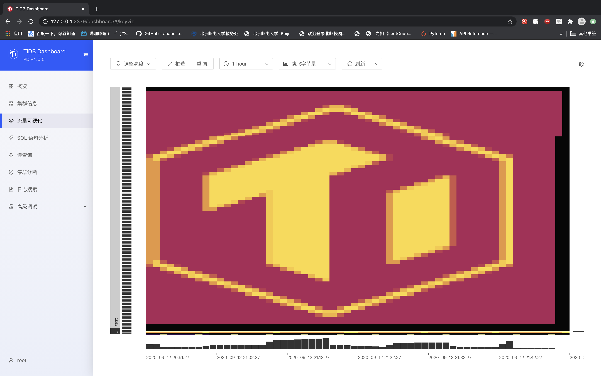
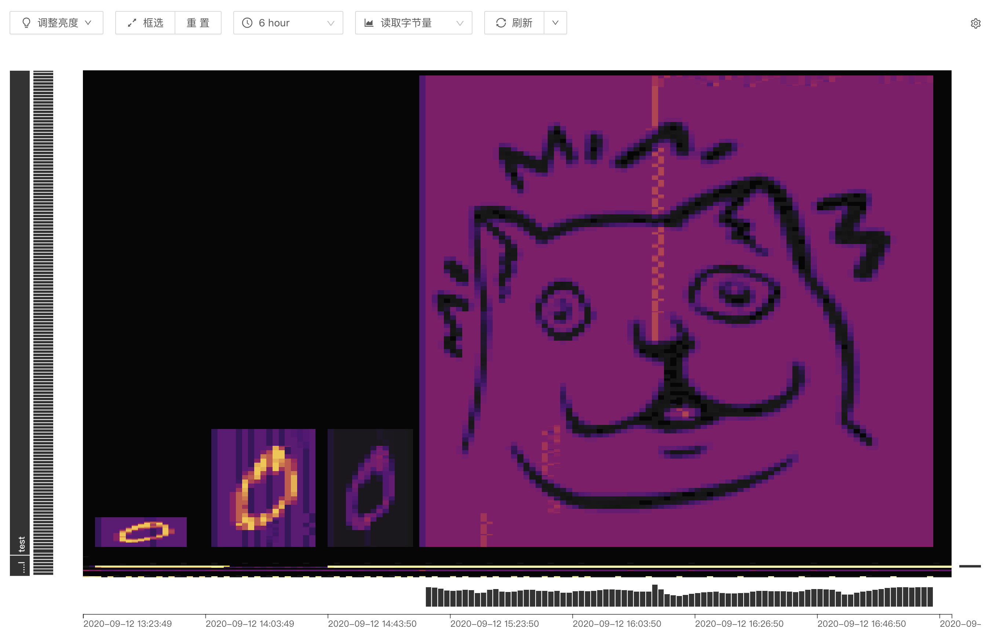

# 为 TiDB 设计一个可观测的负载

选择一张图片，程序连接 TiDB 运行一段时间后，能在 TiDB Dashboard 的 Keyvisualizer 面板上显示出明亮图案

效果图：

### 问题分析

为了便于读取图片、转化为灰度图等操作，选择使用Python实现。

Dashboard 的 Keyvisualizer 是通过监测索引来显示明亮的，因此选择在数据库中创建连续的表来实现图片的”像素定位“。最初想法是通过对自增主键来设置，但是并不太清楚多少数据量会形成”像素“的分界，但是我发现对不同表项的操作在Keyvisualizer上是一定分离的，所以选择创建、访问一系列表来实现。

### 实现方案

- 读入一张图片并转换为灰度图，得到矩阵。
- 根据图片的高度创建对应数量的表项（连续创建时刚开始可能会有表的顺序混乱，因而跳过前几个再画图）
- 根据像素数据访问不同次数的数据库，以在Keyvisualizer上形成明暗点。
- 每隔一分钟（Keyvisualizer每分钟绘制一列）在Keyvisualizer上绘制图片一列的数据，运行一段时间后绘制完成整张图。

### 一些问题及未来的改进

因为并不知道Keyvisualizer图像的绘制数，只能手动测试并尽可能的控制图像比例，最终图像为TiDB标识，比例还算可以接受，同时没有明显的明暗条纹。

效果图二是算是测试的经历，因为Keyvisualizer是长条格，所以需要连续访问几个表形成一个方形”像素“，但这个数量又随图片大小、时间长短而改变。如果访问时间间隔较长，就会出现暗条纹；访问过密又会出现明条纹。最后解决方式是使用计时，使每分钟内开始操作到结束+sleep.time=60s。

时间过长时，可能由于坐标轴的变化，图片会有些不同的伸缩（或者其他原因，这个暂时没有找到解决方式），如小猫的emoji，左右会出现不协调。

